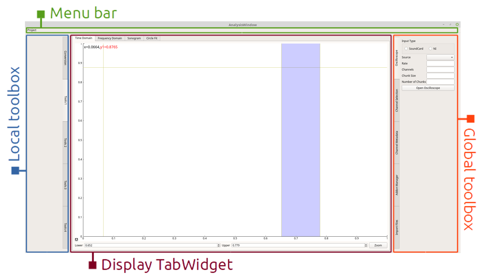

================
Window structure
================

The AnalysisWindow is comprised of three main widgets and a menu bar.

The widgets use PyQt's signal and slot mechanism to interact with each other, rather than interacting directly.

Menu bar
--------
Accessed as :attr:`~cued-datalogger.analysis_window.AnalysisWindow.menubar` in :class:`~cued-datalogger.analysis_window.AnalysisWindow`.

Currently the menu bar is only a placeholder, it has no functionality.

The menu bar will be the place for functions that are not tools for interacting with or affecting
data and tools that will not be used regularly during normal DataLogger operation. For example,  
workspaces will be loaded, configured and saved from the menu bar, as this operation will normally
only be performed once per session.

Local toolbox
-------------
Accessed as :attr:`~cued-datalogger.analysis_window.AnalysisWindow.toolbox` in :class:`~cued-datalogger.analysis_window.AnalysisWindow`.

The local toolbox contains all the operations and conversions that are associated with the widget
that is currently showing in the display TabWidget. If something changes the channel data, or
changes the way that the data is viewed, then it goes in the local toolbox.

Functions in the local toolbox should be grouped into tabs (eg. 'Conversion', 'Peaks')
and then into grouped boxes within a tab (eg. 'Transfer function conversion options', 'Sonogram
conversion options').

Display TabWidget
------------------------------------------------------------------------
Accessed as :attr:`~cued-datalogger.analysis_window.AnalysisWindow.display_tabwidget` in :class:`~cued-datalogger.analysis_window.AnalysisWindow`.

This is the central widget for the AnalysisWindow, where graphs, data, and results are displayed.
For each section of the analysis window (time domain, sonogram, etc) there is one
:class:`~PyQt5.QtWidgets.QWidget` that is created for display, which is the focal point of that
section.

In general it is simply an :class:`~cued-datalogger.api.pyqtgraph_extensions.InteractivePlotWidget`, 
but it can contain other widgets (eg. :class:`~cued-datalogger.analysis.circle_fit.CircleFitWidget`)
if they are absolutely necessary to smooth operation (such as the results tree in the CircleFitWidget).

The user should not have to jump around between the toolboxes and the display TabWidget to view
their results. Operations are kept in the toolboxes; the display TabWidget is for data interaction
and visualisation.

.. note:: Currently no decision has been made about how future modal analysis tools will be added
  to the DataLogger. Will the Circle Fit tab remain solely for circle fitting or will it become 
  a Modal Analysis tab containing options for circle fitting, RFP fitting, etc?

Global toolbox
--------------
Accessed as :attr:`~cued-datalogger.analysis_window.AnalysisWindow.global_toolbox` in :class:`~cued-datalogger.analysis_window.AnalysisWindow`.

The global toolbox contains operations that have a universal effect, and are not limited to one
specific analysis widget. Examples include interacting with channel selection and metadata, or running
addons.

The global toolbox is actually contained within a :class:`~cued-datalogger.api.toolbox.MasterToolbox`,
:attr:`~cued-datalogger.analysis_window.AnalysisWindow.global_master_toolbox` to provide an interface 
symmetric with the local toolbox. However, the user should never need to interact with the 
MasterToolbox, and all of the global functionality should be located in the the 
:attr:`~cued-datalogger.analysis_window.AnalysisWindow.global_toolbox`.

AnalysisWindow widget
---------------------
.. autoclass:: cued-datalogger.analysis_window.AnalysisWindow
  :members:

.. autoclass:: cued-datalogger.analysis_window.AnalysisDisplayTabWidget

